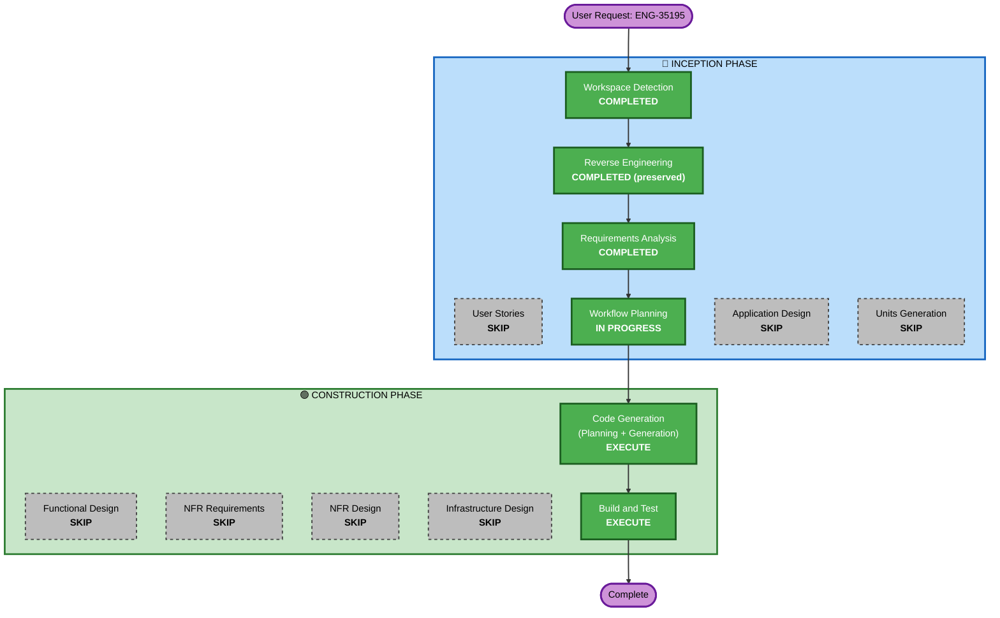

# Execution Plan — ENG-35195: Android Chat SDK Notification Feed Module

## Detailed Analysis Summary

### Transformation Scope
- **Transformation Type**: Single component addition (new module within existing SDK)
- **Primary Changes**: New models, enums, request builders, static methods, and WebSocket listener
- **Related Components**: `CometChat.java` (facade), `ApiConnection.java` (HTTP), `DispatchController.java` (WebSocket events), `CometChatConstants.java` (keys)

### Change Impact Assessment
- **User-facing changes**: Yes — new public API surface (11 methods, 2 builders, 3 models, 2 enums, 1 listener)
- **Structural changes**: No — follows existing architecture patterns exactly
- **Data model changes**: Yes — new models added (no existing models modified)
- **API changes**: Yes — new endpoints consumed (no existing endpoints affected)
- **NFR impact**: No — follows existing patterns for threading, error handling, persistence

### Risk Assessment
- **Risk Level**: Medium
- **Business Impact**: High — customer-requested feature; incorrect API surface or bugs directly affect customer trust and adoption
- **Rollback Complexity**: Easy (new files only, no modifications to existing code except CometChat.java facade)
- **Testing Complexity**: Moderate (serialization, pagination, WebSocket filtering)
- **Mitigation**: Comprehensive design doc reduces ambiguity; following existing SDK patterns reduces implementation risk

## Workflow Visualization

## Phases to Execute

### 🔵 INCEPTION PHASE
- [x] Workspace Detection (COMPLETED)
- [x] Reverse Engineering (COMPLETED — preserved)
- [x] Requirements Analysis (COMPLETED)
- [x] User Stories - SKIP
  - **Rationale**: Design doc defines complete API surface; Linear sub-issues serve as work breakdown
- [x] Workflow Planning (IN PROGRESS)
- [x] Application Design - SKIP
  - **Rationale**: Common design doc already defines all components, interfaces, and dependencies
- [x] Units Generation - SKIP
  - **Rationale**: 5 Linear sub-issues already define units with clear dependency order

### 🟢 CONSTRUCTION PHASE
- [x] Functional Design - SKIP
  - **Rationale**: Design doc provides detailed business logic, API mappings, error handling per component
- [x] NFR Requirements - SKIP
  - **Rationale**: Follow existing SDK patterns; no new infrastructure or scaling concerns
- [x] NFR Design - SKIP
  - **Rationale**: No new patterns needed; existing SDK architecture handles all NFRs
- [x] Infrastructure Design - SKIP
  - **Rationale**: Client SDK library — no infrastructure changes
- [ ] Code Generation - EXECUTE (ALWAYS)
  - **Rationale**: Implementation of all 5 units (models, builders, methods, listener)
- [ ] Build and Test - EXECUTE (ALWAYS)
  - **Rationale**: Verify compilation and test execution

## Unit Execution Order (Code Generation)

Units map directly to Linear sub-issues:

| Order | Linear ID | Unit | Dependencies | Files (estimated) |
|-------|-----------|------|--------------|-------------------|
| 1 | ENG-35196 | Data Models & Enums | None (foundation) | ~7 files |
| 2 | ENG-35197 | NotificationFeedRequestBuilder | ENG-35196 | ~2 files |
| 3 | ENG-35198 | NotificationCategoriesRequestBuilder | ENG-35196 | ~2 files |
| 4 | ENG-35199 | Engagement & Reporting Methods | ENG-35196 | ~1 file (CometChat.java modifications) |
| 5 | ENG-35200 | NotificationFeedListener (WebSocket) | ENG-35196 | ~3 files |

**Critical path**: Unit 1 must complete first. Units 2–5 can theoretically parallelize but will be done sequentially.

## Estimated Timeline
- **Total Phases**: 2 (Code Generation + Build and Test)
- **Estimated Duration**: ~3-4 hours of implementation work across 5 units

## Success Criteria
- **Primary Goal**: Complete Notification Feed SDK module with all public APIs functional
- **Key Deliverables**: Models, enums, request builders, CometChat static methods, WebSocket listener
- **Quality Gates**: Compiles without errors, follows existing SDK patterns, all constants defined
