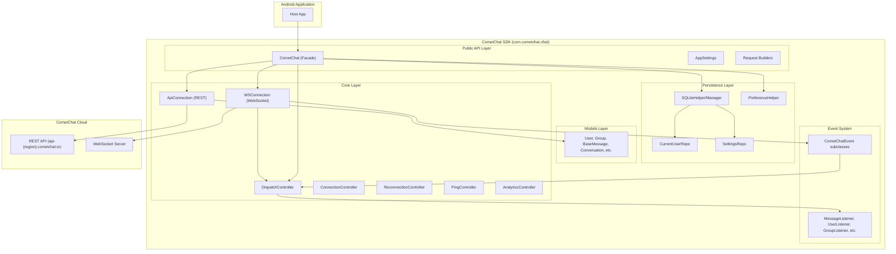
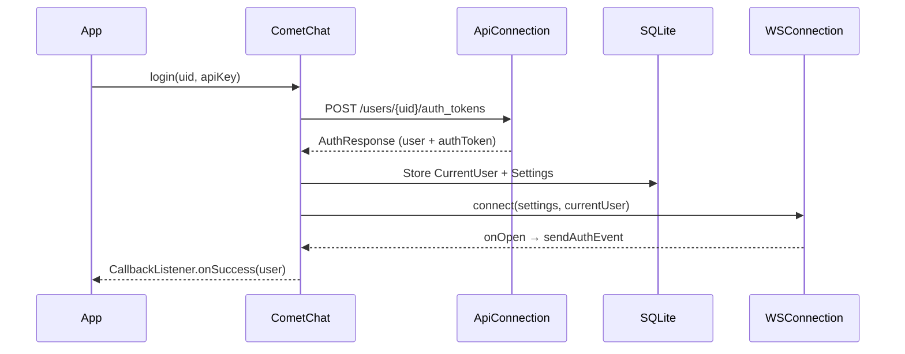
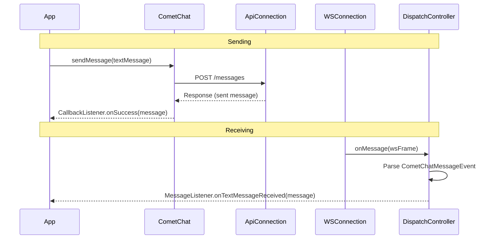

# System Architecture

## System Overview

CometChat Chat SDK for Android is a single-module Android library (AAR) that provides real-time chat, messaging, and calling capabilities. It uses a singleton facade pattern with dual communication channels: REST API for CRUD operations and WebSocket for real-time event delivery.

## Architecture Diagram

## Component Descriptions

### CometChat (Public Facade)
- **Purpose**: Single static class exposing all SDK operations (~10,700 lines)
- **Responsibilities**: Init, auth, messaging, groups, users, calls, typing, receipts, reactions, AI, notifications
- **Dependencies**: ApiConnection, WSConnection, DispatchController, all controllers
- **Type**: Application (Public API)

### ApiConnection (REST Client)
- **Purpose**: HTTP communication with CometChat REST API via OkHttp
- **Responsibilities**: All CRUD operations — login, send messages, create groups, fetch users, upload media
- **Dependencies**: OkHttp, Models, CometChatUtils
- **Type**: Application (Internal)

### WSConnection (WebSocket Client)
- **Purpose**: Persistent real-time connection for instant event delivery
- **Responsibilities**: Connect/disconnect, send/receive WebSocket frames, ping/pong, reconnection
- **Dependencies**: OkHttp WebSocket, DispatchController, ConnectionController
- **Type**: Application (Internal)

### DispatchController (Event Router)
- **Purpose**: Routes incoming WebSocket events to registered listeners on main thread
- **Responsibilities**: Parse events, dispatch to appropriate listener type, handle threading
- **Dependencies**: CometChatEvent subclasses, Listener interfaces
- **Type**: Application (Internal)

### ConnectionController
- **Purpose**: Manages WebSocket connection lifecycle
- **Responsibilities**: Auto-connect on login, disconnect on logout, handle app lifecycle transitions
- **Type**: Application (Internal)

### ReconnectionController
- **Purpose**: Automatic WebSocket reconnection on failure
- **Responsibilities**: Exponential backoff, retry logic, connection state management
- **Type**: Application (Internal)

### PingController
- **Purpose**: WebSocket keep-alive via ping/pong mechanism
- **Responsibilities**: Send periodic pings, detect connection loss via pong timeout
- **Type**: Application (Internal)

### SQLiteHelper / SQLiteManager
- **Purpose**: Local SQLite database for SDK state persistence
- **Responsibilities**: Store current user and settings data (NOT messages)
- **Type**: Application (Internal)

### PreferenceHelper
- **Purpose**: SharedPreferences wrapper for lightweight key-value storage
- **Responsibilities**: Store app ID, auth tokens, device resource ID, settings hash
- **Type**: Application (Internal)

### Models (51 classes)
- **Purpose**: Java POJOs representing business entities
- **Responsibilities**: JSON serialization/deserialization, Parcelable for IPC, value equality
- **Type**: Shared (Public API)

### Request Builders
- **Purpose**: Paginated data fetching with builder pattern
- **Responsibilities**: Configure query parameters, handle cursor-based pagination
- **Type**: Application (Public API)

## Data Flow

### Authentication Flow

### Message Send/Receive Flow

## Integration Points

- **CometChat REST API**: All CRUD operations (messages, users, groups, calls)
- **CometChat WebSocket**: Real-time events (messages, typing, presence, receipts, reactions)
- **CometChat Calls SDK**: Optional voice/video calling (compileOnly dependency)
- **Firebase Cloud Messaging**: Push notification token registration
- **Android Lifecycle**: ProcessLifecycleOwner for foreground/background detection
