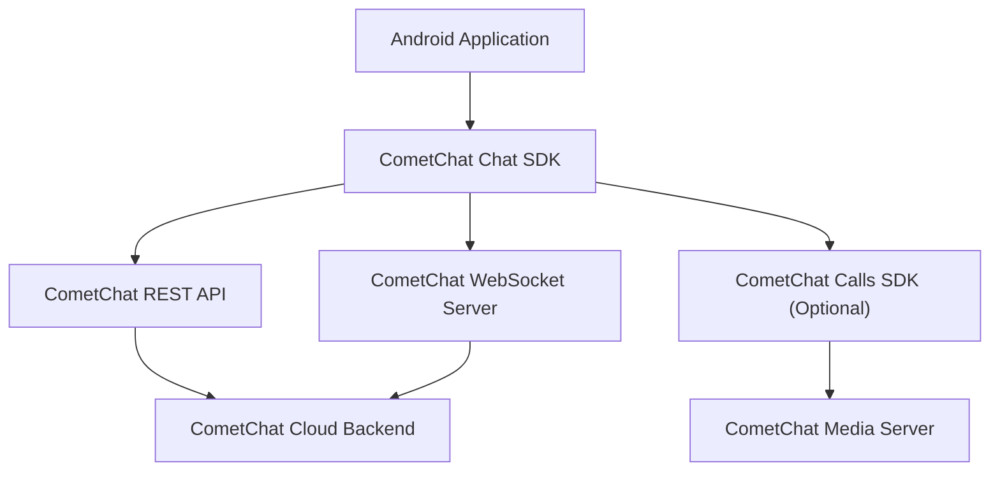

# Business Overview

## Business Context Diagram

## Business Description

- **Business Description**: CometChat Chat SDK for Android is a client-side library that enables Android application developers to integrate real-time chat, messaging, and calling functionality into their applications without building chat infrastructure from scratch. It communicates with CometChat's cloud backend via REST APIs and WebSocket connections.

- **Business Transactions**:
  1. **User Authentication** — Login/logout users via UID+API key or auth token
  2. **Send Message** — Send text, media, custom, or interactive messages to users or groups
  3. **Receive Message** — Real-time message delivery via WebSocket
  4. **Manage Groups** — Create, join, leave, update, delete groups; manage members and scopes
  5. **User Presence** — Track online/offline status of users in real-time
  6. **Typing Indicators** — Send and receive typing start/end events
  7. **Message Receipts** — Mark messages as delivered/read, receive receipt events
  8. **Reactions** — Add/remove emoji reactions on messages
  9. **Content Moderation** — Flag messages for review with reasons
  10. **AI Features** — Smart replies, conversation summary, AI assistant with tool calling
  11. **Push Notifications** — Register FCM tokens, manage notification preferences and DND schedules
  12. **Voice/Video Calling** — Initiate, accept, reject calls (via optional Calls SDK)
  13. **Conversation Management** — Fetch conversation list, unread counts, tags, mute/unmute

- **Business Dictionary**:
  | Term | Meaning |
  |------|---------|
  | UID | Unique identifier for a user in the CometChat system |
  | GUID | Unique identifier for a group |
  | AppID | Application identifier issued by CometChat dashboard |
  | Auth Token | Session token for authenticated user |
  | Receiver Type | Either "user" (1:1) or "group" (group chat) |
  | Message Category | Classification: message, action, call, custom, interactive |
  | Member Scope | Role within a group: admin, moderator, participant |
  | Group Type | Access level: public, private, password-protected |
  | Transient Message | Ephemeral message not persisted (e.g., typing indicators) |
  | Interactive Message | Message with structured UI elements (forms, cards) |
  | Reaction | Emoji response attached to a message |
  | Conversation | A chat thread between two users or within a group |

## Component Level Business Descriptions

### CometChat (Core Facade)
- **Purpose**: Single entry point for all SDK operations — authentication, messaging, group management, calling, and real-time events
- **Responsibilities**: Orchestrates all business transactions, manages listener registration, handles lifecycle

### ApiConnection (REST Layer)
- **Purpose**: Handles all HTTP communication with CometChat REST API
- **Responsibilities**: User auth, message CRUD, group CRUD, user queries, file uploads, push notification management

### WSConnection (WebSocket Layer)
- **Purpose**: Maintains persistent real-time connection for instant event delivery
- **Responsibilities**: Receive messages, typing indicators, presence updates, receipts, reactions in real-time

### Models (Data Layer)
- **Purpose**: Represent business entities as Java objects
- **Responsibilities**: Serialize/deserialize JSON, support Android Parcelable for IPC, provide value equality
