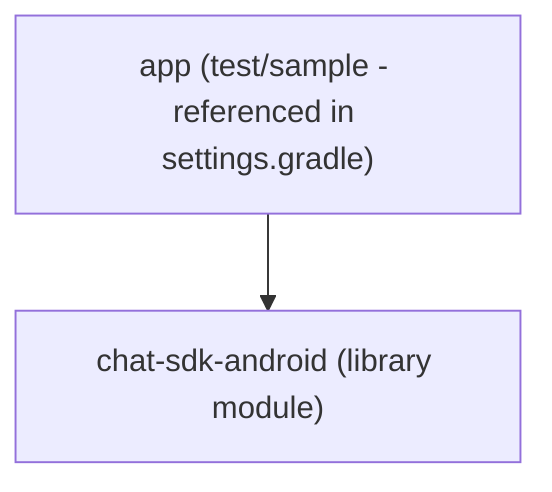
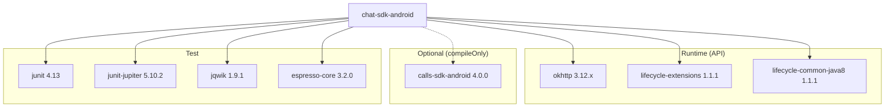

# Dependencies

## Internal Dependencies

This is a single-module project. No internal module dependencies exist.

## External Dependencies

### Runtime Dependencies (API — exposed to consumers)

| Dependency | Version | Purpose | License |
|-----------|---------|---------|---------|
| `com.squareup.okhttp3:okhttp` | 3.12.+ | HTTP client and WebSocket | Apache 2.0 |
| `android.arch.lifecycle:extensions` | 1.1.1 | Lifecycle-aware components | Apache 2.0 |
| `android.arch.lifecycle:common-java8` | 1.1.1 | Java 8 lifecycle support | Apache 2.0 |

### Compile-time Dependencies

| Dependency | Version | Purpose | License |
|-----------|---------|---------|---------|
| `android.arch.lifecycle:compiler` | 1.1.1 | Annotation processor for lifecycle | Apache 2.0 |

### Optional Dependencies (compileOnly — consumer must add)

| Dependency | Version | Purpose | License |
|-----------|---------|---------|---------|
| `com.cometchat:calls-sdk-android` | 4.0.0 | Voice/video calling | Proprietary |

### Test Dependencies

| Dependency | Version | Purpose | Scope |
|-----------|---------|---------|-------|
| `junit:junit` | 4.13 | Unit testing framework | testImplementation, androidTestImplementation |
| `org.junit.jupiter:junit-jupiter` | 5.10.2 | JUnit 5 testing | testImplementation |
| `net.jqwik:jqwik` | 1.9.1 | Property-based testing | testImplementation |
| `org.robolectric:annotations` | 4.3.1 | Robolectric annotations | androidTestImplementation |
| `androidx.test.espresso:espresso-core` | 3.2.0 | UI testing | androidTestImplementation |
| `org.skyscreamer:jsonassert` | 1.5.0 | JSON comparison | androidTestImplementation |

## Dependency Graph

## Exclusions

The following transitive dependencies are explicitly excluded:
- `xpp3:xpp3` — Excluded from all configurations (XML pull parser conflict)

## Repository Sources

| Repository | URL | Purpose |
|-----------|-----|---------|
| Maven Central | (default) | Standard Java/Android libraries |
| Google Maven | `https://maven.google.com` | Android/Google libraries |
| Cloudsmith (public) | `https://dl.cloudsmith.io/public/cometchat/cometchat/maven/` | CometChat v4+ SDKs |

## Notes

- OkHttp uses a floating patch version (`3.12.+`) — this means the exact version depends on what's available at build time
- The Calls SDK is `compileOnly` — it's not bundled in the AAR; consumers must add it separately if they want calling features
- AndroidX Lifecycle uses the older `android.arch.lifecycle` coordinates (pre-AndroidX migration)
