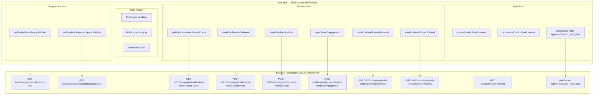

# Design Document: Chat SDK

## Overview

This document defines the Chat SDK layer for the CometChat Notification Feed feature. The SDK provides request builders, data models, engagement reporting methods, push notification callbacks, a dedicated WebSocket listener, and unread count APIs. The SDK is a thin networking + model layer — it does NOT perform template fetching, client-side rendering, or local caching (Phase 1 is network-only).

The SDK maps the backend "Announcement" entity to a client-facing `NotificationFeedItem` model. The backend `subCategory` field maps to the `category` property exposed to consumers.

### Design Principles

1. **Network-only (Phase 1)**: Every `fetchNext()` call hits the network. No local persistence or offline cache.
2. **Idempotent engagement**: All engagement reporting methods are safe to call multiple times without side effects.
3. **Dedicated listener**: `NotificationFeedListener` is independent from Message/Group/Call listeners.
4. **Builder pattern**: Request builders follow existing CometChat SDK conventions (cursor-based pagination, fluent API).
5. **Pre-rendered content**: The SDK receives fully rendered Card_Schema JSON — no template fetching or variable substitution.

## Architecture



## Components and Interfaces

### NotificationFeedRequestBuilder

Constructs paginated, filtered requests for fetching notification feed items.

```typescript
// TypeScript (canonical reference — all platforms follow this shape)
class NotificationFeedRequestBuilder {
  private limit: number = 20;
  private cursor: string | null = null;
  private readState: FeedReadState = FeedReadState.ALL;
  private category: string | null = null;
  private channelId: string | null = null;
  private tags: string[] | null = null;
  private dateFrom: string | null = null; // ISO 8601
  private dateTo: string | null = null;   // ISO 8601

  setLimit(limit: number): NotificationFeedRequestBuilder;
  setReadState(state: FeedReadState): NotificationFeedRequestBuilder;
  setCategory(category: string): NotificationFeedRequestBuilder;
  setChannelId(channelId: string): NotificationFeedRequestBuilder;
  setTags(tags: string[]): NotificationFeedRequestBuilder;
  setDateFrom(date: string): NotificationFeedRequestBuilder;
  setDateTo(date: string): NotificationFeedRequestBuilder;
  build(): NotificationFeedRequestBuilder;

  /**
   * Fetches the next page. Manages cursor internally.
   * Hits: GET /v3.0/campaigns/notification-feed?limit=X&cursor=Y&readState=Z&category=W...
   * Returns: Promise<NotificationFeedItem[]>
   * When server returns no cursor → subsequent fetchNext() returns empty array.
   */
  fetchNext(): Promise<NotificationFeedItem[]>;
}
```

```kotlin
// Kotlin (Android)
class NotificationFeedRequestBuilder {
  fun setLimit(limit: Int): NotificationFeedRequestBuilder
  fun setReadState(state: FeedReadState): NotificationFeedRequestBuilder // READ, UNREAD, ALL
  fun setCategory(category: String): NotificationFeedRequestBuilder
  fun setChannelId(channelId: String): NotificationFeedRequestBuilder
  fun setTags(tags: List<String>): NotificationFeedRequestBuilder
  fun setDateFrom(date: String): NotificationFeedRequestBuilder
  fun setDateTo(date: String): NotificationFeedRequestBuilder
  fun build(): NotificationFeedRequestBuilder
  fun fetchNext(callback: CometChat.CallbackListener<List<NotificationFeedItem>>)
}
```

```swift
// Swift (iOS)
public class NotificationFeedRequestBuilder {
  public func set(limit: Int) -> NotificationFeedRequestBuilder
  public func set(readState: FeedReadState) -> NotificationFeedRequestBuilder
  public func set(category: String) -> NotificationFeedRequestBuilder
  public func set(channelId: String) -> NotificationFeedRequestBuilder
  public func set(tags: [String]) -> NotificationFeedRequestBuilder
  public func set(dateFrom: String) -> NotificationFeedRequestBuilder
  public func set(dateTo: String) -> NotificationFeedRequestBuilder
  public func build() -> NotificationFeedRequestBuilder
  public func fetchNext(onSuccess: @escaping ([NotificationFeedItem]) -> Void,
                        onError: @escaping (CometChatException) -> Void)
}
```

```dart
// Dart (Flutter)
class NotificationFeedRequestBuilder {
  NotificationFeedRequestBuilder setLimit(int limit);
  NotificationFeedRequestBuilder setReadState(FeedReadState state);
  NotificationFeedRequestBuilder setCategory(String category);
  NotificationFeedRequestBuilder setChannelId(String channelId);
  NotificationFeedRequestBuilder setTags(List<String> tags);
  NotificationFeedRequestBuilder setDateFrom(String date);
  NotificationFeedRequestBuilder setDateTo(String date);
  NotificationFeedRequestBuilder build();
  Future<List<NotificationFeedItem>> fetchNext();
}
```

### NotificationCategoriesRequestBuilder

Fetches available notification categories for filter chips.

```typescript
class NotificationCategoriesRequestBuilder {
  private limit: number = 50;
  private cursor: string | null = null;

  setLimit(limit: number): NotificationCategoriesRequestBuilder;
  build(): NotificationCategoriesRequestBuilder;

  /**
   * Hits: GET /v3.0/campaigns/templates/categories?limit=X&cursor=Y
   * Returns: Promise<NotificationCategory[]>
   */
  fetchNext(): Promise<NotificationCategory[]>;
}
```

### Engagement & Reporting Methods

All methods are exposed as static methods on the `CometChat` class (following existing SDK patterns):

```typescript
// Engagement — In-App Feed
CometChat.markFeedItemAsDelivered(feedItem: NotificationFeedItem): Promise<void>;
CometChat.markFeedItemsAsDelivered(feedItems: NotificationFeedItem[]): Promise<void>;
CometChat.markFeedItemAsRead(feedItem: NotificationFeedItem): Promise<void>;
CometChat.markAllFeedItemsAsRead(): Promise<void>;
CometChat.reportFeedEngagement(feedItem: NotificationFeedItem, type: FeedEngagementType): Promise<void>;

// Unread Count
CometChat.getNotificationFeedUnreadCount(): Promise<{ count: number }>;

// Push Notification Engagement (separate from in-app feed)
CometChat.markPushNotificationDelivered(pushNotification: PushNotification): Promise<void>;
CometChat.markPushNotificationClicked(pushNotification: PushNotification): Promise<void>;

// Single Item Fetch (for deep linking)
CometChat.getNotificationFeedItem(id: string): Promise<NotificationFeedItem>;
```

### NotificationFeedListener (Real-Time WebSocket)

```typescript
interface NotificationFeedListener {
  onFeedItemReceived(feedItem: NotificationFeedItem): void;
}

// Registration
CometChat.addNotificationFeedListener(listenerId: string, listener: NotificationFeedListener): void;
CometChat.removeNotificationFeedListener(listenerId: string): void;
```

The listener filters WebSocket messages where `type === "notification_feed_item"`. It does NOT share infrastructure with `MessageListener`, `GroupListener`, or `CallListener`.

**WebSocket envelope structure:**

```json
{
  "appId": "app_abc123",
  "type": "notification_feed_item",
  "receiver": "uid_456",
  "receiverType": "user",
  "sender": "server",
  "body": {
    "action": "sent",
    "feedItem": {
      "id": "ann_789",
      "category": "promotions",
      "content": { /* Card_Schema JSON — fully rendered */ },
      "readAt": null,
      "sentAt": 1719849600,
      "metadata": {},
      "tags": []
    }
  }
}
```

Future `body.action` values (not Phase 1): `"retracted"`, `"updated"`.

## Data Models

### FeedEngagementType (Enum)

Type-safe enum for engagement reporting. Prevents invalid string values.

```typescript
// TypeScript
type FeedEngagementType = "viewed" | "clicked" | "interacted";
```

```kotlin
// Kotlin
enum class FeedEngagementType(val value: String) {
  VIEWED("viewed"),
  CLICKED("clicked"),
  INTERACTED("interacted");
}
```

```swift
// Swift
public enum FeedEngagementType: String {
  case viewed = "viewed"
  case clicked = "clicked"
  case interacted = "interacted"
}
```

```dart
// Dart
enum FeedEngagementType {
  viewed,
  clicked,
  interacted;

  String get value => name;
}
```

### FeedReadState (Enum)

Type-safe enum for filtering feed items by read state in `NotificationFeedRequestBuilder.setReadState()`.

```typescript
// TypeScript
type FeedReadState = "read" | "unread" | "all";
```

```kotlin
// Kotlin
enum class FeedReadState(val value: String) {
  READ("read"),
  UNREAD("unread"),
  ALL("all");
}
```

```swift
// Swift
public enum FeedReadState: String {
  case read = "read"
  case unread = "unread"
  case all = "all"
}
```

```dart
// Dart
enum FeedReadState {
  read,
  unread,
  all;

  String get value => name;
}
```

**Note on** `CLICKED` **vs** `markPushNotificationClicked`**:** These are distinct concepts tracking different delivery channels:

* `reportFeedEngagement(item, CLICKED)` → user tapped a feed item **inside the in-app NotificationFeed UI** → hits `POST /v3.0/campaigns/notification-feed/{id}/engagement`
* `markPushNotificationClicked(push)` → user tapped the **push notification from the system tray** (APNs/FCM) → hits `PUT /v3.0/campaigns/push-notifications/{id}/clicked`

Both can fire for the same announcement (user gets push → taps it → app opens → feed item visible → in-app CLICKED also fires). Backend tracks them independently for campaign channel analytics.

### NotificationFeedItem

Maps from backend "Announcement" entity. The `subCategory` backend field is exposed as `category` to consumers.

```typescript
interface NotificationFeedItem {
  id: string;                          // Unique announcement ID
  category: string;                    // Backend "subCategory" — e.g., "promotions", "updates", "orders"
  content: CardSchema;                 // Fully rendered Card_Schema JSON (ready for CometChatCardsRenderer)
  readAt: number | null;               // Unix timestamp when read, null if unread
  deliveredAt: number | null;          // Unix timestamp when delivered
  sentAt: number;                      // Unix timestamp when sent
  metadata: Record<string, any>;       // Custom key-value metadata
  tags: string[];                      // Optional tags for filtering
  sender: string;                      // Typically "server" for campaign items
  receiver: string;                    // Target user ID
  receiverType: string;                // "user" (Phase 1)
}
```

```kotlin
// Kotlin
data class NotificationFeedItem(
  val id: String,
  val category: String,
  val content: JSONObject,           // Card_Schema JSON
  val readAt: Long?,
  val deliveredAt: Long?,
  val sentAt: Long,
  val metadata: HashMap<String, Any>,
  val tags: List<String>,
  val sender: String,
  val receiver: String,
  val receiverType: String
) {
  val isRead: Boolean get() = readAt != null
}
```

```swift
// Swift
public struct NotificationFeedItem {
  public let id: String
  public let category: String
  public let content: [String: Any]  // Card_Schema JSON dictionary
  public let readAt: Double?
  public let deliveredAt: Double?
  public let sentAt: Double
  public let metadata: [String: Any]
  public let tags: [String]
  public let sender: String
  public let receiver: String
  public let receiverType: String

  public var isRead: Bool { readAt != nil }
}
```

```dart
// Dart
class NotificationFeedItem {
  final String id;
  final String category;
  final Map<String, dynamic> content; // Card_Schema JSON
  final int? readAt;
  final int? deliveredAt;
  final int sentAt;
  final Map<String, dynamic> metadata;
  final List<String> tags;
  final String sender;
  final String receiver;
  final String receiverType;

  bool get isRead => readAt != null;
}
```

### NotificationCategory

```typescript
interface NotificationCategory {
  id: string;           // Category identifier (used in setCategory filter)
  label: string;        // Display label for UI (filter chip text)
}
```

### PushNotification

The `PushNotification` object is provided by the CometChat Push Notification SDK (not constructed by the Chat SDK). The Chat SDK's `markPushNotificationDelivered` and `markPushNotificationClicked` methods accept this object as-is from the push SDK's payload parsing.

```typescript
// Provided by CometChat Push Notification SDK — not defined in Chat SDK
interface PushNotification {
  id: string;                          // Announcement ID from push payload
  announcementId: string;              // Same as id — for clarity
  campaignId: string | null;           // Campaign ID if from a campaign
  source: 'campaign';                  // Always "campaign" for notification feed pushes
}
```

### Developer-Facing Public API Summary

Complete list of all public methods, classes, enums, and listener interfaces added to the Chat SDK:

**Static Methods on** `CometChat`**:**

| # | Method | Parameters | Returns | Description |
| -- | -- | -- | -- | -- |
| 1 | `addNotificationFeedListener` | `listenerId: String`, `listener: NotificationFeedListener` | void | Register real-time feed listener |
| 2 | `removeNotificationFeedListener` | `listenerId: String` | void | Unregister feed listener |
| 3 | `markFeedItemAsDelivered` | `feedItem: NotificationFeedItem` | void (async) | Report single item delivered |
| 4 | `markFeedItemsAsDelivered` | `feedItems: List<NotificationFeedItem>` | void (async) | Report multiple items delivered (batch) |
| 5 | `markFeedItemAsRead` | `feedItem: NotificationFeedItem` | void (async) | Mark single item as read |
| 6 | `markAllFeedItemsAsRead` | — | void (async) | Mark all feed items as read |
| 7 | `reportFeedEngagement` | `feedItem: NotificationFeedItem`, `type: FeedEngagementType` | void (async) | Report viewed/clicked/interacted |
| 8 | `getNotificationFeedUnreadCount` | — | `{ count: number }` (async) | Get total unread count |
| 9 | `getNotificationFeedItem` | `id: String` | `NotificationFeedItem` (async) | Fetch single item (deep linking) |
| 10 | `markPushNotificationDelivered` | `pushNotification: PushNotification` | void (async) | Report push delivered |
| 11 | `markPushNotificationClicked` | `pushNotification: PushNotification` | void (async) | Report push clicked |

**Request Builder Classes:**

| # | Class | Builder Methods | Terminal Method | Returns |
| -- | -- | -- | -- | -- |
| 1 | `NotificationFeedRequest` | `setLimit(Int)`, `setReadState(FeedReadState)`, `setCategory(String)`, `setChannelId(String)`, `setTags(List<String>)`, `setDateFrom(String)`, `setDateTo(String)`, `build()` | `fetchNext()` | `List<NotificationFeedItem>` (async) |
| 2 | `NotificationCategoriesRequest` | `setLimit(Int)`, `build()` | `fetchNext()` | `List<NotificationCategory>` (async) |

**Listener Interfaces:**

| # | Interface | Callback Method | Parameter |
| -- | -- | -- | -- |
| 1 | `NotificationFeedListener` | `onFeedItemReceived` | `feedItem: NotificationFeedItem` |

**Enums:**

| # | Enum | Values | Used By |
| -- | -- | -- | -- |
| 1 | `FeedEngagementType` | `VIEWED`, `CLICKED`, `INTERACTED` | `reportFeedEngagement()` |
| 2 | `FeedReadState` | `READ`, `UNREAD`, `ALL` | `NotificationFeedRequestBuilder.setReadState()` |

**Models:**

| # | Model | Key Fields |
| -- | -- | -- |
| 1 | `NotificationFeedItem` | `id`, `category`, `content` (Card_Schema JSON), `readAt`, `deliveredAt`, `sentAt`, `metadata`, `tags`, `sender`, `receiver`, `receiverType`, `isRead` |
| 2 | `NotificationCategory` | `id`, `label` |
| 3 | `PushNotification` | `id`, `announcementId`, `campaignId`, `source` (provided by Push Notification SDK) |

---

### API Endpoint Mapping

| SDK Method | HTTP Method | Endpoint | Notes |
| -- | -- | -- | -- |
| `NotificationFeedRequestBuilder.fetchNext()` | GET | `/v3.0/campaigns/notification-feed` | Query params: limit, cursor, readState, category, channelId, tags, dateFrom, dateTo |
| `NotificationCategoriesRequestBuilder.fetchNext()` | GET | `/v3.0/campaigns/templates/categories` | Query params: limit, cursor |
| `getNotificationFeedUnreadCount()` | GET | `/v3.0/campaigns/notification-feed/unread-count` | Returns `{ data: { count: number } }` |
| `getNotificationFeedItem(id)` | GET | `/v3/announcements/{id}` | Single item fetch for deep linking |
| `markFeedItemAsDelivered(feedItem)` | POST | `/v3.0/campaigns/notification-feed/{id}/delivered` | Idempotent |
| `markFeedItemAsRead(feedItem)` | POST | `/v3.0/campaigns/notification-feed/{id}/read` | Idempotent |
| `markAllFeedItemsAsRead()` | POST | `/v3/announcements/read` | Batch mark all as read |
| `reportFeedEngagement(feedItem, type)` | POST | `/v3.0/campaigns/notification-feed/{id}/engagement` | Body: `{ "type": FeedEngagementType.value }`. Type is enum: VIEWED, CLICKED, INTERACTED |
| `markPushNotificationDelivered(push)` | PUT | `/v3.0/campaigns/push-notifications/{id}/delivered` | Idempotent |
| `markPushNotificationClicked(push)` | PUT | `/v3.0/campaigns/push-notifications/{id}/clicked` | Idempotent |

### Scope Boundaries (What the SDK Does NOT Do)

* ❌ Template fetching or caching
* ❌ Client-side variable substitution or rendering
* ❌ Local persistence / offline cache (Phase 1)
* ❌ Kafka event consumption
* ❌ Push notification display (APNs/FCM handles this)
* ❌ Swipe-to-dismiss or delete operations
* ❌ Campaign/template authoring APIs
* ❌ Automatic retry on engagement failure

## Error Handling

| Scenario | SDK Behavior |
| -- | -- |
| Network error on `fetchNext()` | Reject promise / invoke error callback with `CometChatException` containing error code and message |
| Invalid/expired auth token | Return `AUTH_ERR` error code; consumer must re-authenticate |
| Server returns 404 for feed item | Return `NOT_FOUND` error; item may have been retracted |
| Server returns 429 (rate limited) | Return `RATE_LIMITED` error with retry-after hint if available |
| Engagement call fails | Return error to caller; no automatic retry (consumer decides) |
| WebSocket disconnection | Existing CometChat SDK reconnection logic applies; listener re-subscribes automatically on reconnect. Missed items are handled by the UI Kit layer (unread count polling + refresh on reconnect) — not by the SDK |
| Malformed WebSocket payload | Log warning; skip the malformed item; do not crash |
| `fetchNext()` called after exhaustion | Return empty array (no error) |
| Builder used without `build()` | Throw/return configuration error |

## Testing Strategy

### Unit Tests (Example-Based)

* Request builder correctly serializes query parameters for each filter combination
* Data model deserialization from JSON response (happy path + edge cases)
* Cursor management: stores cursor from response, returns empty on exhaustion
* WebSocket message filtering: only `type: "notification_feed_item"` messages pass through
* Listener registration/removal lifecycle
* Error mapping from HTTP status codes to `CometChatException`

### Integration Tests

* End-to-end fetch with live/mock backend (verify pagination works across pages)
* Engagement reporting round-trip (mark delivered → mark read → report engagement)
* WebSocket listener receives real-time items when connected
* Push notification engagement methods hit correct endpoints

### Property-Based Tests

* See Correctness Properties section below
* Library: fast-check (TypeScript/JS), Kotest (Kotlin), SwiftCheck (Swift), dart_check/glados (Dart)
* Minimum 100 iterations per property
* Each test tagged with: **Feature: cometchat-notification-feed-sdk, Property {N}: {title}**

## Correctness Properties

*A property is a characteristic or behavior that should hold true across all valid executions of a system — essentially, a formal statement about what the system should do. Properties serve as the bridge between human-readable specifications and machine-verifiable correctness guarantees.*

### Property 1: Request builder produces correct HTTP request

*For any* valid combination of NotificationFeedRequestBuilder parameters (limit, readState, category, channelId, tags, dateFrom, dateTo), calling `fetchNext()` SHALL construct an HTTP GET request to `/v3.0/campaigns/notification-feed` with query parameters that exactly match the configured values. Similarly, for any valid NotificationCategoriesRequestBuilder configuration, `fetchNext()` SHALL construct the correct request to `/v3.0/campaigns/templates/categories`.

**Validates: Requirements 10.1, 10.3, 15.2**

### Property 2: Cursor lifecycle management

*For any* sequence of paginated server responses, the request builder SHALL correctly manage cursor state: (a) when a response includes a cursor, the subsequent `fetchNext()` call includes that cursor as a query parameter; (b) when a response includes no cursor (null/absent), all subsequent `fetchNext()` calls return an empty array without making a network request.

**Validates: Requirements 10.2, 10.5, 10.6, 15.5**

### Property 3: NotificationFeedItem serialization round-trip

*For any* valid NotificationFeedItem object, serializing it to JSON and then deserializing the JSON back SHALL produce an object equivalent to the original (all fields preserved, no data loss or mutation).

**Validates: Requirements 11.6**

### Property 4: NotificationFeedItem deserialization completeness

*For any* valid server JSON response representing an announcement (with id, subCategory, data, readAt, deliveredAt, sentAt, metadata, tags, sender, receiver, receiverType fields), deserializing into a NotificationFeedItem SHALL produce a model where: `id` is non-empty, `category` maps from the server's `subCategory`, `content` is a non-null object, `sentAt` is a positive number, and `receiver` is non-empty.

**Validates: Requirements 11.1, 11.7**

### Property 5: WebSocket message filtering

*For any* WebSocket message received on the CometChat connection, the NotificationFeedListener SHALL invoke `onFeedItemReceived` if and only if the message has `type === "notification_feed_item"` AND `body.action === "sent"`. Messages with any other type or action SHALL NOT trigger the callback.

**Validates: Requirements 12.3, 12.4**

### Property 6: Engagement endpoint construction

*For any* valid NotificationFeedItem and engagement type ("viewed", "clicked", "interacted"), `reportFeedEngagement` SHALL construct a POST request to `/v3.0/campaigns/notification-feed/{feedItem.id}/engagement` with body `{ "type": <engagementType> }`. Similarly, `markFeedItemAsDelivered` SHALL POST to `.../{id}/delivered`, `markFeedItemAsRead` SHALL POST to `.../{id}/read`, `markPushNotificationDelivered` SHALL PUT to `/v3.0/campaigns/push-notifications/{id}/delivered`, `markPushNotificationClicked` SHALL PUT to `.../{id}/clicked`, and `getNotificationFeedItem(id)` SHALL GET `/v3/announcements/{id}`.

**Validates: Requirements 13.1, 13.2, 13.3, 14.1, 14.2, 19.4**
